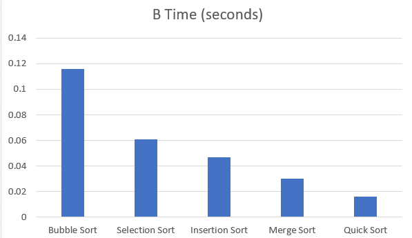
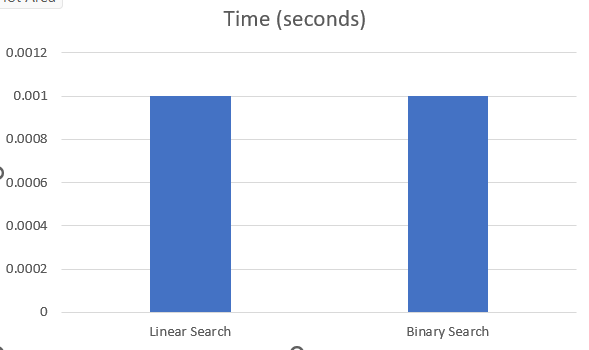
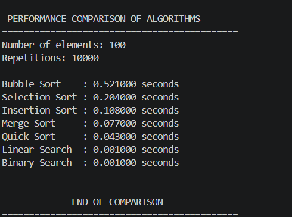

# LAB-2: Comparison of Searching and Sorting Algorithms

## Experiment Title

**Performance Comparison of Searching and Sorting Algorithms Using Execution Time**

---

## 1. Aim

To compare the performance of different searching and sorting algorithms using randomly generated input data and measure their execution time.

The algorithms considered are:

### Searching Algorithms

1. Linear Search
2. Binary Search

### Sorting Algorithms

1. Bubble Sort
2. Selection Sort
3. Insertion Sort
4. Merge Sort
5. Quick Sort

---

## 2. Objectives

The objectives of this experiment are:

* To implement different searching and sorting algorithms.
* To generate random input data containing 100 numbers.
* To measure the execution time of each algorithm.
* To compare the performance of the algorithms.
* To study the relationship between execution time and algorithmic complexity.
* To represent the comparison using tables and graphs.

---

## 3. Input Used

For the performance comparison, **100 random numbers** were generated using the C `rand()` function.

The same set of random numbers was used for each sorting algorithm so that the comparison would be fair.

### Input Size

**Number of elements = 100**

The random numbers were generated in the range:

**0 to 999**

---

# 4. Searching Algorithms

## 4.1 Linear Search

Linear Search checks each element of the array one by one until the required element is found or the end of the array is reached.

### Working

1. Start from the first element.
2. Compare the current element with the target element.
3. If the element matches, return its position.
4. Otherwise, move to the next element.
5. Continue until the element is found or the array ends.

### Time Complexity

* Best Case: **O(1)**
* Average Case: **O(n)**
* Worst Case: **O(n)**

### Space Complexity

**O(1)**

---

## 4.2 Binary Search

Binary Search is used on a **sorted array**. It repeatedly divides the search interval into two halves.

### Working

1. Find the middle element.
2. Compare the middle element with the target.
3. If they are equal, the search is successful.
4. If the target is smaller, search the left half.
5. If the target is larger, search the right half.
6. Repeat until the element is found or the search interval becomes empty.

### Time Complexity

* Best Case: **O(1)**
* Average Case: **O(log n)**
* Worst Case: **O(log n)**

### Space Complexity

**O(1)** for iterative implementation.

---

# 5. Sorting Algorithms

## 5.1 Bubble Sort

Bubble Sort repeatedly compares adjacent elements and swaps them if they are in the wrong order.

### Time Complexity

* Best Case: **O(n)** with optimization
* Average Case: **O(n²)**
* Worst Case: **O(n²)**

### Space Complexity

**O(1)**

---

## 5.2 Selection Sort

Selection Sort repeatedly finds the smallest element from the unsorted portion and places it at the correct position.

### Time Complexity

* Best Case: **O(n²)**
* Average Case: **O(n²)**
* Worst Case: **O(n²)**

### Space Complexity

**O(1)**

---

## 5.3 Insertion Sort

Insertion Sort builds the sorted array one element at a time by inserting each element into its correct position.

### Time Complexity

* Best Case: **O(n)**
* Average Case: **O(n²)**
* Worst Case: **O(n²)**

### Space Complexity

**O(1)**

---

## 5.4 Merge Sort

Merge Sort uses the divide-and-conquer technique. It divides the array into smaller parts, sorts them, and then merges the sorted parts.

### Time Complexity

* Best Case: **O(n log n)**
* Average Case: **O(n log n)**
* Worst Case: **O(n log n)**

### Space Complexity

**O(n)**

---

## 5.5 Quick Sort

Quick Sort also uses the divide-and-conquer technique. It selects a pivot element and partitions the array around the pivot.

### Time Complexity

* Best Case: **O(n log n)**
* Average Case: **O(n log n)**
* Worst Case: **O(n²)**

### Space Complexity

**O(log n)** on average due to recursion.

---

# 6. Performance Comparison of Sorting Algorithms

The sorting algorithms were tested using **100 randomly generated numbers**.

Each algorithm was executed repeatedly so that the execution time could be measured accurately.

## Observed Results

| S. No. | Sorting Algorithm | Execution Time |
| :----: | ----------------- | -------------: |
|    1   | Bubble Sort       |  0.116 seconds |
|    2   | Selection Sort    |  0.061 seconds |
|    3   | Insertion Sort    |  0.047 seconds |
|    4   | Merge Sort        |  0.030 seconds |
|    5   | Quick Sort        |  0.016 seconds |

> **Note:** Execution time depends on the computer, compiler, system load, and randomly generated input. Therefore, the values may vary slightly between different runs.

---

# 7. Analysis of Sorting Results

From the observed results:

* **Bubble Sort** took the highest execution time among the tested algorithms.
* **Selection Sort** performed better than Bubble Sort for the given input.
* **Insertion Sort** was faster than both Bubble Sort and Selection Sort.
* **Merge Sort** showed better performance because of its **O(n log n)** average and worst-case complexity.
* **Quick Sort** produced the lowest execution time in this particular experiment.

Therefore, for the given test data, the observed performance from fastest to slowest was:

**Quick Sort → Merge Sort → Insertion Sort → Selection Sort → Bubble Sort**

---

# 8. Searching Algorithm Performance

Linear Search and Binary Search were also considered for performance comparison.

Binary Search requires the input array to be sorted before searching.

The execution-time results will be recorded after running the performance comparison program.

## Observed Results

| S. No. | Searching Algorithm |            Execution Time |
| :----: | ------------------- | ------------------------: |
|    1   | Linear Search       | **[Enter observed time]** |
|    2   | Binary Search       | **[Enter observed time]** |

### Result Analysis

Linear Search has a time complexity of **O(n)** in the average and worst cases.

Binary Search has a time complexity of **O(log n)**, making it more efficient for searching in a sorted array, especially when the input size becomes large.

---

# 9. Comparison Table

| Algorithm      | Type      | Best Case  | Average Case | Worst Case |
| -------------- | --------- | ---------- | ------------ | ---------- |
| Linear Search  | Searching | O(1)       | O(n)         | O(n)       |
| Binary Search  | Searching | O(1)       | O(log n)     | O(log n)   |
| Bubble Sort    | Sorting   | O(n)       | O(n²)        | O(n²)      |
| Selection Sort | Sorting   | O(n²)      | O(n²)        | O(n²)      |
| Insertion Sort | Sorting   | O(n)       | O(n²)        | O(n²)      |
| Merge Sort     | Sorting   | O(n log n) | O(n log n)   | O(n log n) |
| Quick Sort     | Sorting   | O(n log n) | O(n log n)   | O(n²)      |

---

# 10. Graphical Representation

## 10.1 Sorting Algorithm Execution Time

A bar graph should be prepared using the observed execution times.

### Data for Graph

| Algorithm      | Time (seconds) |
| -------------- | -------------: |
| Bubble Sort    |          0.116 |
| Selection Sort |          0.061 |
| Insertion Sort |          0.047 |
| Merge Sort     |          0.030 |
| Quick Sort     |          0.016 |

### Graph

`Execution Time Comparison of Sorting Algorithms`

---

## 10.2 Searching Algorithm Execution Time

After obtaining the execution times for Linear Search and Binary Search, prepare a bar graph.

### Graph

`Execution Time Comparison of Searching Algorithms`

**X-axis:** Searching Algorithms

**Y-axis:** Execution Time (seconds)

---

# 11. Overall Performance Analysis

The experiment demonstrates that the choice of algorithm has a significant effect on execution time.

The simpler sorting algorithms such as Bubble Sort, Selection Sort, and Insertion Sort generally have **O(n²)** average-case complexity. Their performance becomes less efficient as the input size increases.

Merge Sort and Quick Sort generally provide better performance because they use divide-and-conquer techniques and have an average complexity of **O(n log n)**.

Similarly, Binary Search is more efficient than Linear Search for a sorted array because it reduces the search space by half after every comparison.

Therefore, algorithms with better asymptotic complexity are generally preferred when dealing with large datasets.

---

# 12. Conclusion

The performance of different searching and sorting algorithms was compared using execution time.

For the sorting experiment with 100 randomly generated numbers, **Quick Sort recorded the lowest execution time**, followed by Merge Sort, Insertion Sort, Selection Sort, and Bubble Sort in the observed run.

The experiment also demonstrates the importance of algorithmic complexity. Algorithms such as Merge Sort, Quick Sort, and Binary Search generally provide better performance for larger datasets compared with algorithms having quadratic or linear time complexity.

Thus, selecting an appropriate algorithm based on the size and nature of the input is important for developing efficient programs.

---

# 13. Files Used

The following C programs were developed as part of the experiment:

* `binarysearch.c`
* `linearsearch.c`
* `bubblesort.c`
* `selectionsort.c`
* `insertionsort.c`
* `mergesort.c`
* `quicksort.c`
* `performance.c`

---

### Current Sorting Results Screenshot

---

# 15. Final Result

The searching and sorting algorithms were successfully implemented and their performance was compared using execution time.

The experiment successfully demonstrates the practical difference between algorithms with different time complexities.
